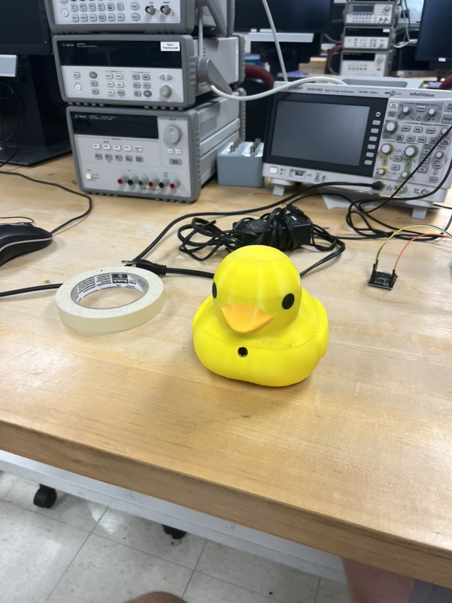

# QuackTrack Robot

## Overview
This was a project for EE327 at Northerstern university. The goal was to create a duck robot that could follow a person around using a camera and computer vision. The project uses an ESP32-CAM to capture images, sends them over a websocket to a computer running Python and OpenCV, and then sends commands back to the robot to control its motors. The robot uses 2 micro metal gear motors to drive around, and has an IMU to help control angular velocity. The robot is powered by a 3.7V LiPo battery.

